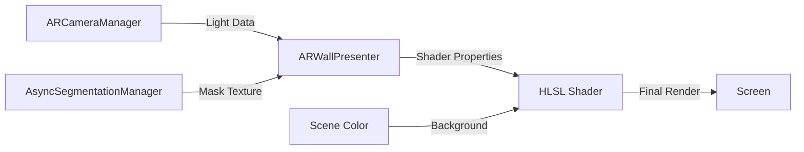

# 🎯 Комплексный план развития фотореалистичной окраски стен в AR
## Проект: wallSegmentation - Dulux Visualizer Style Implementation

*Создан на основе исследований Gemini AI и ChatGPT-4*  
*Дата: Декабрь 2024*

---

## 📋 Содержание
1. [Обзор проекта](#overview)
2. [Текущий статус](#current-status)
3. [Архитектурная стратегия](#architecture)
4. [Техническая реализация](#technical)
5. [Поэтапный план развития](#phases)
6. [Оптимизация производительности](#optimization)
7. [Тестирование и валидация](#testing)
8. [Риски и митигация](#risks)

---

## <a id="overview"></a>🎨 1. Обзор проекта

### Цель
Создание фотореалистичного эффекта перекраски стен в реальном времени для AR-приложения, аналогичного Dulux Visualizer.

### Ключевые требования
- **Фотореализм**: Сохранение текстуры, теней и освещения стен
- **Реальное время**: 60 FPS на мобильных устройствах
- **Кроссплатформенность**: iOS (ARKit) и Android (ARCore)
- **Энергоэффективность**: Минимальный расход батареи

### Существующая архитектура
```
AsyncSegmentationManager → WallSegmentation → ARWallPresenter
     (AI сегментация)     (постобработка)    (рендеринг)
```

---

## <a id="current-status"></a>📊 2. Текущий статус

### ✅ Завершено
- **C# архитектура**: ARWallPresenter с MaterialPropertyBlock
- **HLSL шейдер**: WallPaintSimple.shader с Scene Color и Overlay blend
- **Интеграция AR Foundation**: Данные освещения и камеры
- **Базовое сглаживание**: 3x3 box blur для краев маски
- **Отладочные инструменты**: ContextMenu методы для тестирования

### ⚠️ В процессе (Фаза 3)
- **Продвинутое сглаживание**: Переход на fwidth() для краев
- **Профилирование**: Анализ производительности на устройствах

### ❌ Не начато
- **Глубокая оптимизация**: Half precision, vertex shader optimizations
- **Расширенные функции**: HDR light estimation, directional lighting
- **Автоматизированное тестирование**: CI/CD пайплайн для производительности

---

## <a id="architecture"></a>🏗️ 3. Архитектурная стратегия

### 3.1 Принципы дизайна
1. **Сохранение существующей архитектуры**: Минимальные изменения в AsyncSegmentationManager
2. **Модульность**: ARWallPresenter как независимый контроллер рендеринга
3. **Производительность первого класса**: GPU-ориентированная архитектура

### 3.2 Ключевые компоненты

#### ARWallPresenter (Контроллер рендеринга)
- **Управление материалом**: Кастомный material instance
- **Передача данных**: Light estimation → Shader properties
- **Геометрия**: Полноэкранный quad с динамическим масштабированием
- **Конфигурация**: Flip controls, mask inversion, edge softness

#### HLSL Shader (WallPaintSimple.shader)
- **Scene Color**: Доступ к камере через URP Opaque Texture
- **Overlay Blending**: Математически точное смешивание
- **Light Integration**: Real-time brightness и color correction
- **Edge Smoothing**: Configurable blur для плавных переходов

#### Интеграция данных


---

## <a id="technical"></a>⚙️ 4. Техническая реализация

### 4.1 Алгоритм смешивания цветов

#### Luminance-Based Recoloring (ChatGPT подход)
```hlsl
// Rec.709 luminance weights
float luminance = dot(sceneColor.rgb, float3(0.2126, 0.7152, 0.0722));
float3 recoloredWall = paintColor.rgb * luminance;
```

#### Overlay Blend Mode (Gemini подход)
```hlsl
half3 BlendOverlay(half3 base, half3 blend) {
    return lerp(
        2.0 * base * blend,                           // Multiply для темных
        1.0 - 2.0 * (1.0 - base) * (1.0 - blend),   // Screen для светлых
        step(0.5, base)
    );
}
```

#### Гибридный подход (Рекомендуемый)
```hlsl
// 1. Получаем освещенный цвет краски
half3 litPaintColor = _PaintColor.rgb * _RealWorldLightColor.rgb * _GlobalBrightness;

// 2. Выбираем алгоритм на основе настройки
half3 finalColor;
if (_BlendMode == 0) {
    // Luminance preservation (более реалистично для однотонных стен)
    half luminance = dot(sceneColor.rgb, half3(0.2126, 0.7152, 0.0722));
    finalColor = litPaintColor * luminance;
} else {
    // Overlay blend (лучше для текстурированных стен)
    finalColor = BlendOverlay(sceneColor.rgb, litPaintColor);
}
```

### 4.2 Продвинутое сглаживание краев

#### Текущий метод (Box Blur)
```hlsl
// Простое 3x3 размытие
half blur = 0;
for(int x = -1; x <= 1; x++) {
    for(int y = -1; y <= 1; y++) {
        float2 offset = float2(x, y) * texelSize * _EdgeSoftness;
        blur += SAMPLE_TEXTURE2D(_SegmentationMask, sampler_SegmentationMask, uv + offset).r;
    }
}
blur /= 9.0;
```

#### Целевой метод (Screen-Space Derivatives)
```hlsl
// Адаптивное сглаживание на основе экранных производных
float edgeWidth = fwidth(maskValue) * _EdgeSoftnessMultiplier;
float alpha = smoothstep(0.5 - edgeWidth, 0.5 + edgeWidth, maskValue);
```

### 4.3 Интеграция AR Light Estimation

#### Базовые данные освещения
```csharp
private void OnFrameReceived(ARCameraFrameEventArgs eventArgs) {
    var lightEstimation = eventArgs.lightEstimation;
    
    // Глобальная яркость
    if (lightEstimation.averageBrightness.HasValue) {
        float brightness = lightEstimation.averageBrightness.Value;
        if (brightness > 0.01f) { // Предотвращение черных вспышек
            _propertyBlock.SetFloat(GlobalBrightnessId, brightness);
        }
    }
    
    // Цветовая коррекция (температура света)
    if (lightEstimation.colorCorrection.HasValue) {
        Color colorCorrection = lightEstimation.colorCorrection.Value;
        _propertyBlock.SetColor(RealWorldLightColorId, colorCorrection);
    }
}
```

#### Расширенные данные (для будущего развития)
```csharp
// HDR Environment (где поддерживается)
if (lightEstimation.mainLightDirection.HasValue) {
    Vector3 mainLightDir = lightEstimation.mainLightDirection.Value;
    _propertyBlock.SetVector(MainLightDirectionId, mainLightDir);
}

if (lightEstimation.sphericalHarmonicsCoefficients != null) {
    // Ambient lighting от сферических гармоник
    _propertyBlock.SetVectorArray(SHCoefficientsId, lightEstimation.sphericalHarmonicsCoefficients);
}
```

---

## <a id="phases"></a>🚀 5. Поэтапный план развития

### Фаза 1: Базовая функциональность ✅ ЗАВЕРШЕНА
**Сроки**: Декабрь 2024 (завершено)

#### Задачи
- ✅ Настройка ARCameraManager и light estimation
- ✅ Базовый HLSL шейдер с Scene Color
- ✅ Интеграция маски сегментации
- ✅ Простое overlay blending

#### Результат
Работающий эффект окраски стен с базовой функциональностью.

---

### Фаза 2: Улучшение качества ⚠️ В ПРОЦЕССЕ
**Сроки**: Январь 2025 (2-3 недели)

#### Задача 2.1: Продвинутое сглаживание краев
```hlsl
// Реализовать fwidth-based antialiasing
float edgeWidth = fwidth(maskValue);
float smoothAlpha = smoothstep(0.5 - edgeWidth * _EdgeSoftnessMultiplier, 
                               0.5 + edgeWidth * _EdgeSoftnessMultiplier, 
                               maskValue);
```

#### Задача 2.2: Гибридные алгоритмы смешивания
- Добавить переключение между Luminance и Overlay
- Реализовать Color blend mode (HSL-based)
- Добавить настройки интенсивности смешивания

#### Задача 2.3: Улучшенная интеграция освещения
- Поддержка HDR light estimation
- Адаптивная цветовая температура
- Учет направленного освещения (где доступно)

#### Результат
Визуально завершенный фотореалистичный эффект готовый для тестирования.

---

### Фаза 3: Оптимизация производительности 🎯 ТЕКУЩАЯ ФАЗА
**Сроки**: Февраль 2025 (3-4 недели)

#### Задача 3.1: Глубокая оптимизация шейдера
**Приоритет**: ВЫСОКИЙ

##### Точность вычислений
```hlsl
// Переход на half precision где возможно
half3 sceneColor = SampleSceneColor(screenUV);
half maskValue = SAMPLE_TEXTURE2D(_SegmentationMask, sampler_SegmentationMask, uv).r;
half3 litPaintColor = _PaintColor.rgb * _RealWorldLightColor.rgb * _GlobalBrightness;
```

##### Предвычисления на CPU
```csharp
// ARWallPresenter.cs - предвычисление на CPU
private void UpdateLitPaintColor() {
    Color litColor = new Color(
        paintColor.r * realWorldLightColor.r * globalBrightness,
        paintColor.g * realWorldLightColor.g * globalBrightness,
        paintColor.b * realWorldLightColor.b * globalBrightness,
        paintColor.a
    );
    _propertyBlock.SetColor(LitPaintColorId, litColor);
}
```

##### Устранение ветвлений
```hlsl
// Заменить if/else на lerp/step
half blendFactor = _BlendMode; // 0.0 = Luminance, 1.0 = Overlay
half3 luminanceResult = litPaintColor * dot(sceneColor, half3(0.2126, 0.7152, 0.0722));
half3 overlayResult = BlendOverlay(sceneColor, litPaintColor);
half3 finalColor = lerp(luminanceResult, overlayResult, blendFactor);
```

#### Задача 3.2: Оптимизация текстур
- **Формат маски**: R8 вместо RGBA32 (4x меньше памяти)
- **Отключение Mipmaps**: Для масок сегментации
- **Compression**: ASTC для дополнительных текстур

#### Задача 3.3: Профилирование и измерения
**Целевые метрики**:
- **GPU время**: <5ms на кадр (для эффекта)
- **Память**: <50MB дополнительного использования
- **FPS**: Поддержание 60 FPS на iPhone 12/Galaxy S20
- **Батарея**: <10% дополнительного расхода

**Инструменты**:
- Unity Profiler (GPU модуль)
- Frame Debugger
- XCode Instruments (iOS)
- Android GPU Inspector

#### Результат
Готовая к релизу оптимизированная версия с подтвержденной производительностью.

---

### Фаза 4: Расширенные функции 🔮 БУДУЩЕЕ
**Сроки**: Март-Апрель 2025 (по необходимости)

#### Задача 4.1: Продвинутое освещение
- Интеграция сферических гармоник
- Поддержка множественных источников света
- Реальные тени от виртуальных объектов

#### Задача 4.2: Улучшенная сегментация
- Временное сглаживание маски (TAA)
- Upscaling низкоразрешающих масок
- Адаптивное качество сегментации

#### Задача 4.3: UI/UX улучшения
- Цветовая палитра с предпросмотром
- Сохранение/загрузка настроек
- Экспорт результатов

---

## <a id="optimization"></a>⚡ 6. Оптимизация производительности

### 6.1 Чек-лист мобильной оптимизации

#### GPU Shader оптимизации
- [ ] **Half precision**: Использовать `half` для цветов и UV
- [ ] **Vertex calculations**: Перенести вычисления в vertex shader
- [ ] **Texture sampling**: Минимизация количества samplers
- [ ] **Branch elimination**: Замена if/else на lerp/step
- [ ] **MAD instructions**: Объединение multiply-add операций

#### Memory оптимизации
- [ ] **Texture formats**: R8 для масок, ASTC для RGB
- [ ] **Mipmap control**: Отключение для экранных текстур
- [ ] **Buffer pooling**: Переиспользование RenderTextures
- [ ] **GC optimization**: MaterialPropertyBlock вместо new Material

#### CPU оптимизации
- [ ] **Precomputation**: Lighting calculations на CPU
- [ ] **Update frequency**: Ограничение обновлений по необходимости
- [ ] **Async operations**: Неблокирующие операции сегментации

### 6.2 Стратегия профилирования

#### Тестовые устройства
- **iOS**: iPhone 12, iPhone SE 3rd gen
- **Android**: Galaxy S20, Pixel 6, OnePlus 9

#### Методология тестирования
```csharp
// Встроенный профилировщик для измерения GPU времени
public class PerformanceProfiler {
    private float[] frameTimes = new float[60];
    private int frameIndex = 0;
    
    void Update() {
        frameTimes[frameIndex] = Time.unscaledDeltaTime;
        frameIndex = (frameIndex + 1) % frameTimes.Length;
        
        if (frameIndex == 0) {
            float avgFrameTime = frameTimes.Sum() / frameTimes.Length;
            float avgFPS = 1.0f / avgFrameTime;
            Debug.Log($"Average FPS: {avgFPS:F1}, Frame time: {avgFrameTime*1000:F2}ms");
        }
    }
}
```

#### Целевые benchmarks
- **Baseline** (без эффекта): 60 FPS
- **With effect**: >55 FPS (91% of baseline)
- **GPU budget**: <8.3ms total frame time
- **Memory overhead**: <50MB

---

## <a id="testing"></a>🧪 7. Тестирование и валидация

### 7.1 Функциональные тесты

#### Визуальное качество
- [ ] **Сохранение текстуры**: Детали стены видны через краску
- [ ] **Световая интеграция**: Краска реагирует на освещение
- [ ] **Сглаживание краев**: Плавные переходы без артефактов
- [ ] **Цветовая точность**: Соответствие выбранного и отображаемого цвета

#### Платформенная совместимость
- [ ] **iOS ARKit**: Полная функциональность на iPhone
- [ ] **Android ARCore**: Полная функциональность на Android
- [ ] **Light estimation**: Корректная работа на обеих платформах
- [ ] **Performance parity**: Одинаковая производительность

### 7.2 Автоматизированные тесты

#### Unit тесты
```csharp
[Test]
public void ARWallPresenter_SetPaintColor_UpdatesShader() {
    var presenter = CreateARWallPresenter();
    var testColor = Color.red;
    
    presenter.SetPaintColor(testColor);
    
    var material = presenter.GetComponent<Renderer>().material;
    Assert.AreEqual(testColor, material.GetColor("_PaintColor"));
}

[Test]
public void BlendOverlay_ProducesCorrectOutput() {
    var result = ShaderTestUtils.BlendOverlay(
        new Color(0.3f, 0.3f, 0.3f), 
        new Color(1.0f, 0.0f, 0.0f)
    );
    
    // Для темных цветов должен использоваться Multiply
    Assert.AreEqual(new Color(0.6f, 0.0f, 0.0f), result, 0.01f);
}
```

#### Performance тесты
```csharp
[Performance]
public void MeasureShaderPerformance() {
    using (Measure.Frames().WarmupCount(10).MeasurementCount(100)) {
        // Render with wall painting effect
        TestRenderer.RenderFrame();
    }
}
```

### 7.3 User Acceptance Testing

#### Тестовые сценарии
1. **Различные типы стен**: Гладкие, текстурированные, с обоями
2. **Освещение**: Дневной свет, искусственный свет, смешанное
3. **Цвета**: Светлые, темные, насыщенные, пастельные
4. **Углы обзора**: Прямо, под углом, близко, далеко

#### Критерии успеха
- **Реализм**: >80% пользователей оценивают как "очень реалистично"
- **Удобство**: Время настройки <30 секунд
- **Стабильность**: 0 критических багов в производстве

---

## <a id="risks"></a>⚠️ 8. Риски и митигация

### 8.1 Технические риски

#### Производительность на слабых устройствах
**Риск**: Низкий FPS на бюджетных Android устройствах  
**Вероятность**: Средняя  
**Влияние**: Высокое  
**Митигация**: 
- Адаптивное качество (LOD система)
- Отключение эффекта на слабых GPU
- Предупреждение пользователя о требованиях

#### Различия в AR Foundation между платформами
**Риск**: Несогласованность между iOS и Android  
**Вероятность**: Средняя  
**Влияние**: Среднее  
**Митигация**:
- Fallback механизмы для отсутствующих функций
- Platform-specific code paths
- Тщательное тестирование на обеих платформах

#### Изменения в Unity/AR Foundation API
**Риск**: Breaking changes в новых версиях  
**Вероятность**: Низкая  
**Влияние**: Среднее  
**Митигация**:
- Использование LTS версии Unity
- Версионирование зависимостей
- Регулярные обновления с тестированием

### 8.2 Проектные риски

#### Неточность сегментации стен
**Риск**: AI модель плохо определяет стены  
**Вероятность**: Средняя  
**Влияние**: Высокое  
**Митигация**:
- Улучшение обучающих данных
- Пост-обработка маски
- Пользовательская коррекция границ

#### Высокое энергопотребление
**Риск**: Быстрая разрядка батареи  
**Вероятность**: Средняя  
**Влияние**: Высокое  
**Митигация**:
- Агрессивная оптимизация
- Режим энергосбережения
- Предупреждения пользователю

---

## 📈 Заключение и следующие шаги

### Текущий прогресс
Проект находится в **Фазе 3** с успешно реализованной базовой функциональностью. Основные компоненты работают, но требуется оптимизация для production-ready состояния.

### Приоритеты на ближайшие 2-4 недели
1. **Реализация fwidth-based сглаживания** - улучшение визуального качества
2. **Глубокое профилирование** - измерение производительности на целевых устройствах  
3. **Шейдер оптимизация** - переход на half precision и устранение ветвлений
4. **Автоматизированное тестирование** - настройка CI/CD для регрессионного тестирования

### Долгосрочное видение
Создание передового AR-инструмента для визуализации интерьеров с возможностью:
- Реального времени ray-traced освещения
- Физически корректных материалов (PBR)
- Интеграции с облачными AI сервисами
- Социального шаринга результатов

---

*Документ будет обновляться по мере прогресса проекта*  
*Последнее обновление: Декабрь 2024*