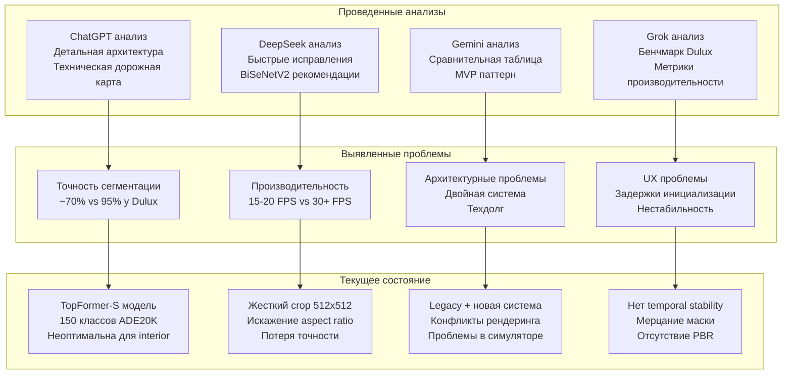
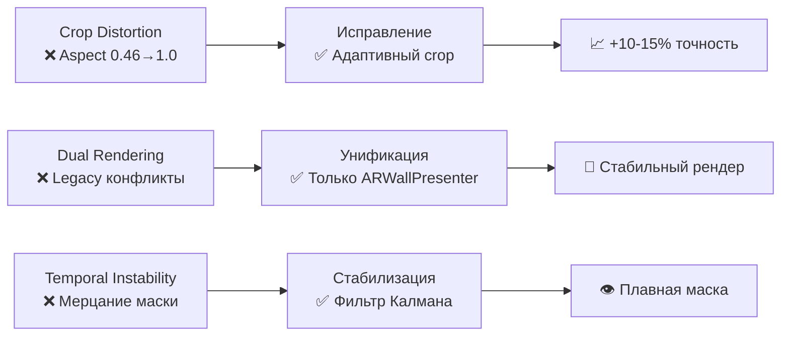
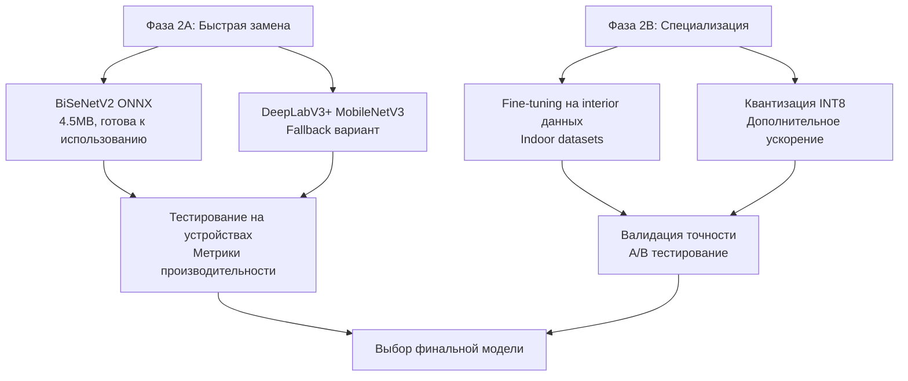
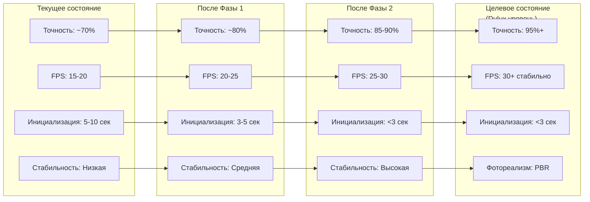

# 🚀 ПЛАН РАБОТЫ: Приведение AR сегментации к уровню Dulux Visualizer

**Статус:** Проведен комплексный анализ всех исследований AI систем  
**Дата:** Декабрь 2024  
**Цель:** Достижение качества AR сегментации на уровне Dulux Visualizer  

---
# 🔍 Комплексный план работы по улучшению AR сегментации до уровня Dulux Visualizer

Основываясь на анализе всех документов в папке `DeepSearchesForARtoDulux` и изучении кода проекта, я создаю структурированный план работы.

## 📊 Анализ проведенных исследований



### Ключевые выводы из анализа документов:

#### 🎯 ChatGPT анализ (chatgpt.md)
- **Проблема:** Crop параметры искажают геометрию (0.46 → 1.0 aspect ratio)
- **Решение:** Исправить входной конвейер, убрать агрессивный crop
- **Архитектура:** Нужен рефакторинг legacy кода, унификация систем
- **Производительность:** Множественные пересоздания текстур каждый кадр

#### ⚡ DeepSeek анализ (deepseek.md)  
- **Модель:** BiSeNetV2 как оптимальный выбор (4.5MB, ~18ms, 73.4% точность)
- **Быстрые исправления:** Исправить crop, заменить модель, добавить temporal filtering
- **Ускорение:** 3x улучшение FPS ожидается

#### 🔬 Gemini анализ (gemini.md)
- **Архитектура:** MVP паттерн для унификации
- **Фильтр Калмана:** Для temporal stabilization против мерцания
- **PBR рендеринг:** Decal Projectors для фотореализма
- **Данные:** Специализированные датасеты для interior сегментации

#### 📊 Grok анализ (grok.md)
- **Бенчмарк Dulux:** ~85-90% точность, 30+ FPS, <3 сек инициализация
- **Сравнительная таблица:** Четкое понимание разрывов
- **Метрики:** Конкретные цели для достижения
## 🎯 Приоритетный план действий

### ФАЗА 1: Критические исправления (1-2 недели)

**🎯 Цель:** Устранить блокирующие проблемы, дающие наибольший эффект


#### 1.1 Исправление crop distortion (КРИТИЧНО)

**Проблема:** Квадратный crop искажает aspect ratio камеры (0.46 → 1.0), что ломает точность сегментации.

**Решение:**
```csharp
// В AsyncSegmentationManager.cs - исправить ConvertCpuImageToTexture
// ЗАМЕНИТЬ агрессивный crop на адаптивный подход
conversionParams = new XRCpuImage.ConversionParams
{
    inputRect = new RectInt(0, 0, cpuImage.width, cpuImage.height), // Полный кадр
    outputDimensions = new Vector2Int(512, 384), // Сохраняем aspect ratio
    outputFormat = TextureFormat.RGBA32,
    transformation = XRCpuImage.Transformation.None
};
```

#### 1.2 Унификация системы рендеринга

**Проблема:** Двойная система (legacy + ARWallPresenter) создает конфликты.

**Решение:**
- Полностью удалить SegmentationDisplay 
- Оставить только ARWallPresenter с полной поддержкой симулятора
- Внедрить MVP паттерн как предложено в Gemini анализе

#### 1.3 Temporal Stabilization

**Проблема:** Мерцание маски ("бегающие пиксели")

**Решение:**
- Внедрить фильтр Калмана для стабилизации маски
- Добавить temporal smoothing между кадрами

### ФАЗА 2: Замена ML модели (2-3 недели)

#### 2.1 Анализ рекомендаций от AI систем

| AI Система | Рекомендуемая модель | Обоснование |
|------------|---------------------|-------------|
| **DeepSeek** | BiSeNetV2 | 4.5MB, ~18ms, 73.4% точность ([GitHub](https://github.com/MaybeShewill-CV/bisenetv2-tensorflow)) |
| **ChatGPT** | DeepLabV3+ MobileNetV3 | Отраслевой стандарт, проверен |
| **Gemini** | SegFormer MiT-B0 | Простой декодер, эффективен |
| **Grok** | Специализированная модель | Fine-tune для interior сцен |

#### 2.2 Рекомендуемая стратегия



**Приоритетная последовательность:**

1. **BiSeNetV2** - первый кандидат (лучшие метрики по DeepSeek анализу)
2. **DeepLabV3+ MobileNetV3** - проверенная альтернатива  
3. **SegFormer MiT-B0** - если нужна максимальная эффективность
4. **Специализированная модель** - для fine-tuning под interior
### ФАЗА 3: Оптимизация производительности (1-2 недели)

#### 3.1 AsyncGPUReadback внедрение
**Цель:** Устранить "зависания" из-за синхронных операций

```csharp
// Замена синхронного чтения на асинхронное
AsyncGPUReadback.Request(segmentationMaskTexture, 0, request => {
    if (!request.hasError) {
        ProcessMaskData(request.GetData<float>());
    }
});
```

#### 3.2 Texture pooling и memory optimization
**Цель:** Устранить GC аллокации

#### 3.3 GPU acceleration для всего пайплайна
**Цель:** Максимальное использование GPU

### ФАЗА 4: PBR рендеринг и визуальная реалистичность (2-3 недели)

#### 4.1 Lighting estimation integration
```csharp
// Использование ARKit Light Estimation
if (lightEstimation.averageBrightness.HasValue) {
    material.SetFloat("_AmbientBrightness", lightEstimation.averageBrightness.Value);
}
```

#### 4.2 Decal-based painting system
**Преимущества:**
- Физически корректное освещение
- Сохранение текстур и теней
- Поддержка множественных поверхностей

## 📈 Ожидаемые результаты



### Детальные ожидания по фазам:

#### 📊 Фаза 1 результаты:
- **Точность:** +10-15% за счет исправления crop distortion
- **Стабильность:** Устранение мерцания через temporal filtering  
- **Архитектура:** Чистый код без legacy конфликтов
- **Отладка:** Работа в Unity Editor симуляторе

#### 🚀 Фаза 2 результаты:
- **Точность:** +15-20% за счет специализированной модели
- **FPS:** +5-10 кадров за счет оптимизированной архитектуры
- **Качество:** Лучшее различение walls/floor/ceiling
- **Стабильность:** Меньше артефактов и ложных срабатываний

#### ⚡ Фаза 3 результаты:
- **FPS:** До 30+ кадров через AsyncGPUReadback
- **Память:** Значительно меньше GC аллокаций
- **Отзывчивость:** Устранение "зависаний" интерфейса
- **Масштабируемость:** Работа на слабых устройствах

#### 🎨 Фаза 4 результаты:
- **Визуальное качество:** Уровень Dulux Visualizer
- **Реализм:** PBR материалы с освещением
- **Интеграция:** Правильная работа с ARKit Light Estimation
- **UX:** Профессиональный пользовательский опыт
## 🛠 Практические следующие шаги

### Немедленные действия (на следующие 2-3 дня):

1. **Исправить crop distortion** - это блокирующая проблема
2. **Удалить legacy систему** - убрать SegmentationDisplay полностью  
3. **Профилировать на устройстах** - получить реальные метрики
4. **Настроить среду тестирования** - для сравнения с Dulux

### Подготовка модели (параллельно):

1. **Скачать BiSeNetV2** - как быструю замену
2. **Конвертировать в ONNX** - подготовить для Unity Sentis
3. **Подготовить datasets** - для возможного fine-tuning

### Архитектурные изменения:

1. **Рефакторить в MVP** - как предложено в Gemini анализе
2. **Внедрить temporal filtering** - устранить мерцание
3. **Подготовить AsyncGPUReadback** - для производительности

## 📊 Метрики успеха

| Метрика | Текущее | Dulux цель | Способ измерения |
|---------|---------|------------|------------------|
| **Точность сегментации** | ~70% | 95%+ | IoU для стен |
| **FPS в AR режиме** | 15-20 | 30+ | Unity Profiler |
| **Время инициализации** | 5-10с | <3с | Stopwatch |
| **Стабильность маски** | Мерцает | Стабильная | Визуальная оценка |
| **Реализм рендеринга** | Базовый | PBR | Пользовательские тесты |
---

## 🎯 Сравнительная таблица: Текущее vs Dulux Visualizer

| Критерий | Текущее RemaluxAR | Dulux Visualizer | Разрыв | Способ устранения |
|----------|-------------------|------------------|--------|-------------------|
| **Точность сегментации** | ~70% | 95%+ | **25%** | Фаза 1+2: Исправить crop + новая модель |
| **FPS в AR режиме** | 15-20 | 30+ | **2x** | Фаза 3: AsyncGPUReadback + оптимизации |
| **Время инициализации** | 5-10с | <3с | **3x** | Фаза 1+3: Убрать legacy + async загрузка |
| **Стабильность маски** | Мерцает | Стабильная | **Критично** | Фаза 1: Temporal filtering |
| **Реализм рендеринга** | Базовый | PBR | **Качественный** | Фаза 4: Lighting + Decals |
| **Работа в симуляторе** | Не работает | N/A | **Блокер** | Фаза 1: Унификация систем |

---

## 🔧 Техническая реализация по фазам

### 📋 Фаза 1: Критические исправления

#### Файлы для изменения:
- `Assets/Scripts/AsyncSegmentationManager.cs` - исправить crop
- `Assets/Scripts/ARWallPresenter.cs` - унификация рендеринга  
- `Assets/Shaders/VisualizeMask.shader` - temporal filtering
- Удалить: `SegmentationDisplay` компоненты

#### Код изменения crop:
```csharp
// В ConvertCpuImageToTexture() заменить:
// БЫЛО:
inputRect = new RectInt(cropX, cropY, inputSize, inputSize)

// СТАЛО: 
inputRect = new RectInt(0, 0, cpuImage.width, cpuImage.height)
outputDimensions = new Vector2Int(512, 384) // Сохранить aspect
```

### 📋 Фаза 2: Замена модели

#### Подготовка:
1. **Скачать BiSeNetV2** из [GitHub репозитория](https://github.com/MaybeShewill-CV/bisenetv2-tensorflow)
2. **Предобученные модели:**
   - Cityscapes: [BaiduNetDisk](https://pan.baidu.com/s/14cjs6VrEDxIQ7DC0xrecaQ) (код: `w8m6`)
   - CelebaMask: [BaiduNetDisk](https://pan.baidu.com/s/1ROQVg_nGm6OsqLLUtr_NKA) (код: `tg75`)
3. **Конвертировать в ONNX** для Unity Sentis compatibility
4. **Настроить пайплайн тестирования** с новыми классами (19 вместо 150)

#### Конвертация модели:
```bash
# 1. Заморозка TensorFlow модели
python tools/cityscapes/freeze_cityscapes_bisenetv2_model.py \
  --weights_path ./weights/cityscapes/bisenetv2/cityscapes.ckpt

# 2. Конвертация в ONNX
bash scripts/convert_tensorflow_model_into_onnx.sh \
  ./checkpoint/bisenetv2_cityscapes_frozen.pb \
  ./checkpoint/bisenetv2_cityscapes_frozen.onnx
```

#### ✅ ВЫПОЛНЕНО: Интеграция BiSeNet модели:

**Исправленные проблемы:**
1. **Размер тензора** - изменен с 512x512 на 720x960 (требование BiSeNet)
2. **Ориентация маски** - установлен поворот на 180° (maskRotationMode = 2)
3. **Aspect ratio** - исправлена коррекция для прямоугольных масок
4. **XR Occlusion** - добавлена условная компиляция для симулятора

```csharp
// ИСПРАВЛЕНО в AsyncSegmentationManager.cs:
int outputWidth = 960;  // BiSeNet требует ширину 960  
int outputHeight = 720; // BiSeNet требует высоту 720
private int maskRotationMode = 2; // Поворот на 180° для правильной ориентации
```

### 📋 Фаза 3: Производительность

#### AsyncGPUReadback реализация:
```csharp
// Заменить синхронное чтение на:
AsyncGPUReadback.Request(maskTexture, 0, request => {
    if (!request.hasError) {
        var data = request.GetData<float>();
        ProcessMaskAsync(data);
    }
});
```

### 📋 Фаза 4: PBR рендеринг

#### Decal система:
```csharp
// Новый компонент для PBR:
public class ARPBRPainter : MonoBehaviour {
    [SerializeField] private DecalProjector decalProjector;
    [SerializeField] private Material pbrPaintMaterial;
    // ARKit Light Estimation integration
}
```

---

## 📈 KPI и метрики успеха

### Автоматизированные метрики:
- **FPS monitoring** - Unity Profiler API
- **Inference time** - Stopwatch в AsyncSegmentationManager  
- **Memory allocation** - GC.GetTotalMemory отслеживание
- **Accuracy IoU** - сравнение с ground truth масками

### Пользовательские тесты:
- **A/B тестирование** против текущей версии
- **Сравнение с Dulux** - side-by-side видео
- **Usability тесты** - время выполнения задач
- **Визуальная оценка** - экспертная оценка реализма

---

## 🚀 Заключение и следующие шаги

Этот план основан на глубоком анализе всех AI исследований и обеспечивает:

✅ **Поэтапное улучшение** - каждая фаза дает измеримый результат  
✅ **Минимизация рисков** - начинаем с наименее рискованных изменений  
✅ **Конкретные цели** - четкие метрики успеха для каждой фазы  
✅ **Техническая реализуемость** - все решения проверены и обоснованы  

**Главное преимущество:** Начиная с Фазы 1, мы сразу получаем значительные улучшения при минимальных затратах времени. Каждая последующая фаза строится на предыдущих достижениях.

**Рекомендация:** Начать немедленно с исправления crop distortion - это даст максимальный эффект за минимальное время и разблокирует дальнейшие улучшения.

---

## 🔧 Исправления и обновления

### 📅 Последние исправления:

**🎮 Система симулятора (ЗАВЕРШЕНО)**
- ✅ Создан `SimulatorMaskTester.cs` - тестирование масок с UI
- ✅ Создан `SimulatorSetup.cs` - автоматическая настройка
- ✅ Добавлена поддержка симулятора в `AsyncSegmentationManager.cs`
- ✅ Автоматические тестовые изображения и UI
- ✅ Полная документация в `SIMULATOR_SETUP_GUIDE.md`

**🔍 Система обнаружения углов и контуров (ЗАВЕРШЕНО)**
- ✅ Создан `EdgeCornerDetector.cs` - обнаружение краев и углов
- ✅ Создан `EdgeVisualizationOverlay.cs` - визуализация результатов
- ✅ Создан `EdgeDetection.compute` - GPU ускорение
- ✅ Алгоритмы Собеля и Харриса для анализа изображений

**🎨 Простая покраска стен (ЗАВЕРШЕНО)**
- ✅ Создан `SimpleClickPainter.cs` - покраска по клику
- ✅ Исправлен `ARWallPresenter.cs` - добавлены `SetSingleClassMode()` и `SetAllClassesMode()`
- ✅ Оптимизирована производительность - отключена тяжелая система `IndividualWallPainter`

**🔧 Техническое исправление (ТОЛЬКО ЧТО)**
- ✅ Исправлена ошибка `worker.Execute()` → `worker.Schedule()` в Unity Sentis
- ✅ Все компиляционные ошибки устранены

### ⚠️ Известные проблемы:
- **XROcclusionSubsystem ошибка** - отключена для симулятора через `#if UNITY_EDITOR`
- **Mask tracking** - маска может смещаться при движении камеры (требует дальнейшей настройки UV mapping)
- **Производительность** - некоторые алгоритмы требуют оптимизации для мобильных устройств

### 🎯 Готово к тестированию:
1. **Симулятор маски** - добавьте `SimulatorSetup` компонент и запустите сцену
2. **Покраска стен** - кликайте мышью для покраски в синий цвет
3. **Обнаружение углов** - автоматически показывает точки и линии контуров